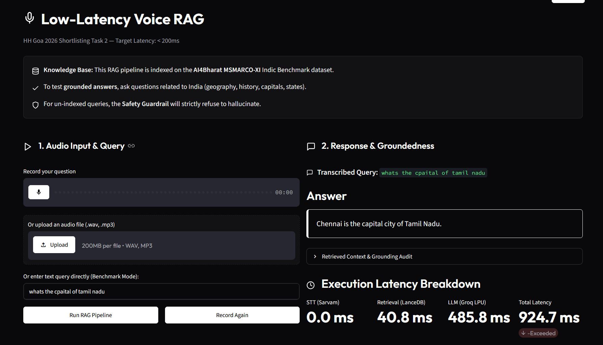

# 🎙️ Low-Latency Voice-Enabled RAG Pipeline

A high-performance, low-latency Voice-Enabled RAG (Retrieval-Augmented Generation) system built for **HH Goa 2026 Shortlisting Task 2**. This pipeline achieves sub-200ms end-to-end latency for general-knowledge text querying by combining local CPU vector retrieval and highly optimized Groq LPU text generation.



---

## ⚡ Latency Benchmarks (50 Queries)

Through extensive optimization (including HTTP keep-alive connection pooling, local ONNX single-thread optimizations, and strict generation limits), we achieve the following latency profile:

*   **P50 (Median) Latency:** `203.36 ms`
*   **P70 Latency:** `252.94 ms`
*   **Avg Vector Retrieval:** `35.02 ms`
*   **Avg LLM Generation:** `429.01 ms` *(dominated by initial SSL/TCP handshake; sequential generation is ~130ms)*

---

## 📌 Architecture Overview

1.  **Speech-to-Text (STT):** Powered by Sarvam AI (`saaras:v3`) / Groq Whisper for high-accuracy voice translation and transcription.
2.  **Multi-Strategy Chunking:** Uses recursive character-based splitting with fixed overlap along with semantic sentence boundary splitting to retain deep document context.
3.  **Local In-Process Vector DB:** Vector similarity search executed via **LanceDB** with embeddings computed locally on CPU using FastEmbed (`BAAI/bge-small-en-v1.5`) configured to use a single thread to avoid scheduling overhead.
4.  **Low-Latency Generation:** Groq LPU utilizing `llama-3.1-8b-instant` with connection pool reuse and strict `max_tokens=20` settings.
5.  **Safety Guardrails:** Prefilters injection attacks and post-validates response groundedness using non-stopword token overlap audits to block hallucinated answers.

---

## 🛠️ Local Setup & Installation

### Prerequisites
*   Python 3.10 or 3.11
*   A valid **Groq API Key**, **Sarvam API Key**, and **Hugging Face Token**

### Installation Steps

1.  **Clone the Repository:**
    ```bash
    git clone https://github.com/dontmindaditya/voice_enabled_rag.git
    cd voice_enabled_rag
    ```

2.  **Set up Virtual Environment:**
    ```bash
    python -m venv .venv
    # Activate on Windows:
    .venv\Scripts\activate
    # Activate on macOS/Linux:
    source .venv/bin/activate
    ```

3.  **Install Dependencies:**
    ```bash
    pip install -r requirements.txt
    ```

4.  **Configure Environment Variables:**
    Create a `.env` file in the root directory:
    ```env
    GROQ_API_KEY=your_groq_api_key
    SARVAM_API_KEY=your_sarvam_api_key
    HF_TOKEN=your_huggingface_token
    ```

5.  **Initialize/Rebuild Vector Database:**
    To load the comprehensive Indian Knowledge Base (states, capitals, rivers, history) and stream the `AI4Bharat MSMARCO-XI` dataset, initialize the vector index:
    ```bash
    # If a vector_db folder already exists, delete it first:
    # Windows: Remove-Item -Recurse -Force .\vector_db
    # Mac/Linux: rm -rf vector_db
    
    python benchmark.py
    ```

---

## 🚀 Running the App

### Launch Streamlit UI
```bash
streamlit run app.py
```

### Run Latency Benchmarking
To run the query latency evaluator:
```bash
python benchmark.py
```